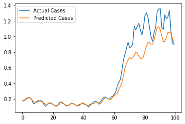
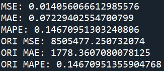
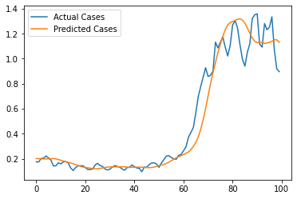
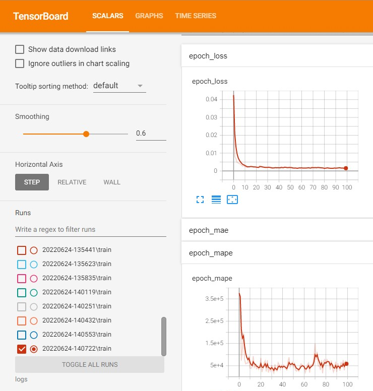
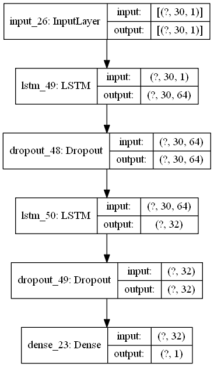
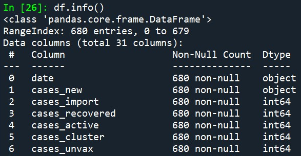
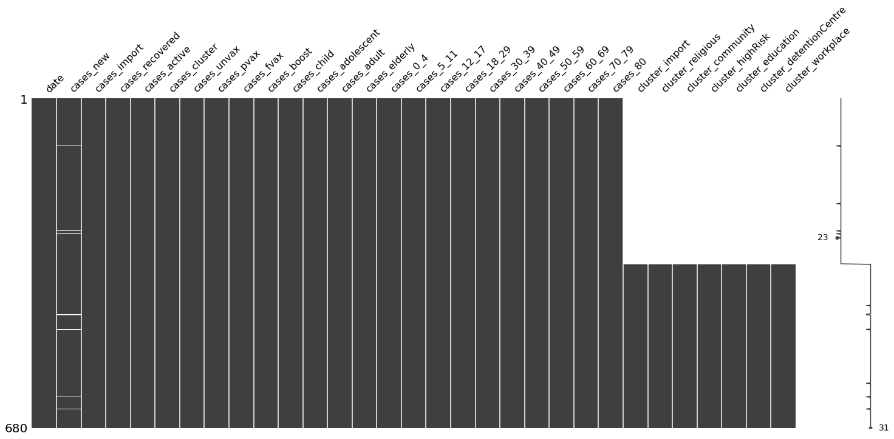
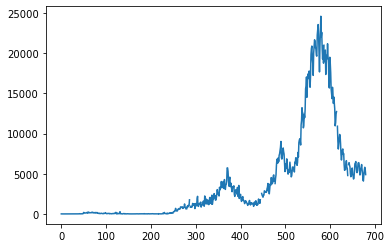
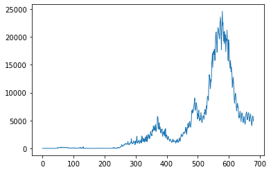

<a></a>

# [RNN] What's for TOMORROW? -COVID-19_Case_Predict-
As slow as it takes I am finally pick up a dying trend (or maybe not) : COVID-19 Case Prediction Model! Predictions are important especially when it comes to anticipating a crisis e.g. food supply shortage, disease breakout, earthquake/volcanic eruptions etc. [Dataset](https://github.com/KTong06/-RNN-COVID19_Case_Predict/tree/main/dataset) is readily available.

[UPDATE] Model optimization : Improved model performance by increase training epoch to 1000, reducing MAPE to 0.11.


# Model Performance
Model is able to achieve **Mean Absolute Percentage Error (MAPE)** of value **0.14**: (MSE-Mean Squared Error, MAE-Mean Absolute Error)



### Actual vs. Predicted


### Loss and MAPE Plot


# Model Architecture
RNN model is constructed using 2 LSTM layers with `activation function='tanh'`, having 64 and 32 nodes respectively:



### Other hyperparameters
Hyperparameter **optimizer**,**loss function**,**metrics** are summarised below:
```
model.compile(optimizer='adam',loss='mse',metrics=['mse','mae','mape'])

tb=TensorBoard(log_dir=LOG_PATH)

hist=model.fit(x_train,y_train,batch_size=64,epochs=100,callbacks=tb,verbose=1)
```
# Data Summary
Train and test dataset are available in separate files, having shape of `(680,31)` and `(100,31)` respectively, and have following features:

`'date', 'cases_new', 'cases_import', 'cases_recovered', 'cases_active','cases_cluster', 'cases_unvax', 'cases_pvax', 'cases_fvax','cases_boost', 'cases_child', 'cases_adolescent', 'cases_adult','cases_elderly', 'cases_0_4', 'cases_5_11', 'cases_12_17','cases_18_29', 'cases_30_39', 'cases_40_49','cases_50_59','cases_60_69', 'cases_70_79', 'cases_80', 'cluster_import','cluster_religious', 'cluster_community', 'cluster_highRisk','cluster_education', 'cluster_detentionCentre', 'cluster_workplace'`, whereby `'cases_new'` is the **target feature**.

## Data Inspection / Cleaning
### Train Dataset
Upon inspection `'cases_new'` in train dataset contain non-numeric values as such:



To convert non-numeric values to null values the following code is appplied:
`df['cases_new']=pd.to_numeric(df['cases_new'],errors='coerce')`

12 **null values** observed in `'cases_new'` are represented as white stripes in figure below:



The following code is appplied to impute null values in time series data:

`df['cases_new']=df['cases_new'].interpolate(method='linear')`

|               Before               |                         After                          |
|------------------------------------|--------------------------------------------------------|
|  |  |

    Notice the little gaps on line plot (left figure) dissapeared after interpolated (right figure).

### Test Dataset
1 **null value** is identified and imputed using `pandas.DataFrame.interpolate()` method.

# Preprocessing
Train and test datasets are preprocessed in a similar fashion.
### Normalize data
To normalize target feature:
```
df_scaled=mms.fit_transform(np.expand_dims(df['cases_new'],axis=-1))`
df_test_scaled=mms.transform(df_test_ori)
```
### Create train and test datasets
**Window size** of 30 is selected to create train and test datasets, these datasets consist of rows of consecutive 30-values list: 
```
x_train=[]
y_train=[]

for i in range(win_size,np.shape(df_scaled)[0]):
    x_train.append(df_scaled[i-win_size:i])
    y_train.append(df_scaled[i])
    
# Increase dimension to fit into RNN model
x_train=np.array(x_train)
y_train=np.array(y_train)
```
For test dataset:
```
# Concatenate scaled train and test dataset
concat_df=np.concatenate([df_scaled,df_test_scaled],axis=0)

# Create test dataset
concat_test=concat_df[-130:]

x_test=[]

for i in range(win_size,np.shape(concat_test)[0]):
    x_test.append(concat_test[i-win_size:i])

x_test=np.array(x_test)
```

# Discussion
From the prediction plot we could see the model tries to keep up with the trend of real cases with minor 'lagness', and tends to represent as 'moving averages' when real cases fluctuates. Proceeding with the spike of real cases the performance of model reduced even more and not able to capture the rapid and fluctuations of real cases. As such, the model still has room for improvement although achieving evaluation MAPE value of 0.14. Some suggestions to improve include:
- [x] Increase number of epoch
- [ ] Implement `Bidirectional()` LSTM layer.
- [ ] Modify model architecture as such to incorporate CNN pooling layers.
- [ ] Apply moving average in data preprocessing step to smoothen the fluctuations.


